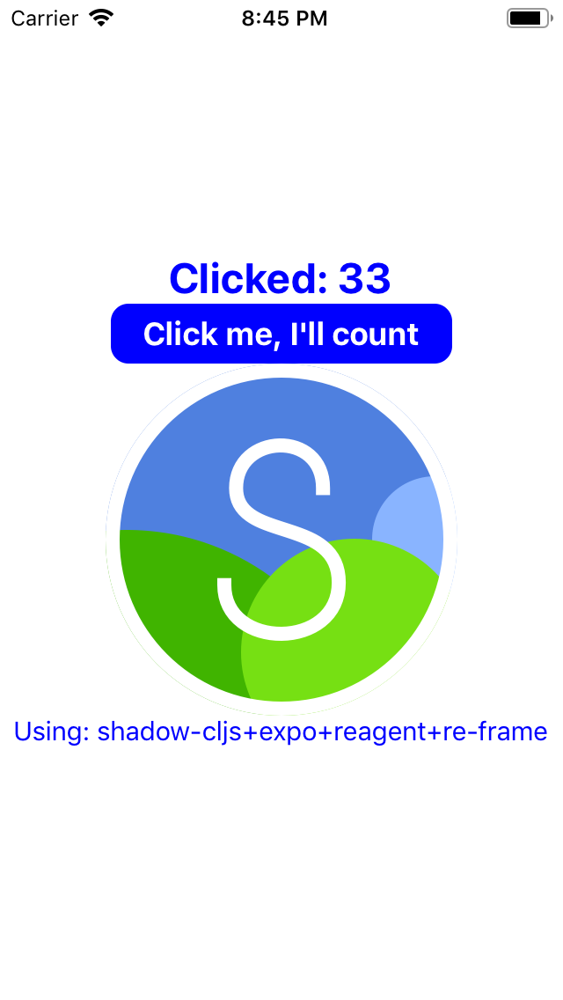

# React Native using shadow-cljs in 3 minutes

The fastest way a [ClojureScript](https://clojurescript.org/) coder can get started with React Native development. *Prove me wrong.*

This is an example project, only slightly beyond *Hello World*, using: [shadow-cljs](https://github.com/thheller/shadow-cljs), [React Native](https://facebook.github.io/react-native/), [Expo](https://expo.io/), [Reagent](https://reagent-project.github.io/), and [re-frame](https://github.com/Day8/re-frame).

<div style="display: flex; justify-content: space-around;">
  <div style="flex: 1"></div>
  <div style="flex: 1">Check this video out for a demo of this project.<br>
  <a href="https://www.youtube.com/watch?v=QsUj7HO5xDg"><br>
ClojureScript ❤️ React Native</a>
  </div>
</div>

Follow along to get started. There are instructions for [Calva](http://calva.io), [Emacs/CIDER](https://cider.mx), [Cursive](https://cursive-ide.com), and the command line. It is assumed you have Java and Node installad as well as dev tool chains for the platforms you are targeting. (If you are targeting the Web, then Chrome is enough.)

## Installing

To facilitate that you can easily try this out without installing anything globally on your machine, this project installs everything it needs locally in `node_modules`. Then `npx` is used to execute tools like `expo-cli`.

To install dependencies, and setup the project, run:

1. `npm i`

From there use your favorite editor and/or the prompt.

## Using VS Code + Calva

0. Install the [Calva](https://calva.io) extension in VS Code.
1. Open the project in VS Code. Then:
1. Run the Calva command **Start a Project REPL and Connect (aka Jack-in)**
   1. Select the project type `Hello RN Shadow`.
   1. Wait for shadow to build the project.
1. Then **Run Build Task**. This will start Expo and the Metro
   builder. Wait for it to fire up Expo DevTools in your browser.
   1. Click **Run in web browser**
1. When the app is running the Calva CLJS REPL can be used. Confirm this by evaluating something like: 
   ``` clojure
   (js/alert "Hello world!")
   ```
   (You should see the alert pop up where the app is running.)
1. Hack away!

Of course you should try to fire up the app on all simulators, emulators and phones you have as well. The Expo UI makes this really easy.

## Using Emacs with CIDER

Open Emacs and a bash shell:

1. Run `npx shadow-cljs compile :app` to perform an initial build of the app.
1. In Emacs open one of the files in the project (`deps.edn` is fine)
1. From that buffer, do `cider-jack-in-clojurescript` [C-c M-J] to
   launch a REPL. Follow the series of interactive prompts in the
   minibuffer:
   1. select `shadow-cljs` as the command to launch
   1. select `shadow` as the repl type
   1. select `:app` as the build to connect
   1. and optionally answer `y` or `n` to the final question about
      opening the `shadow-cljs` UI in a browser.
   At this point `shadow-cljs` will be watching the project folder and
   running new builds of the app if any files are changed. You'll also
   have a REPL prompt, *however the REPL doesn't work because it isn't
   connected to anything. The app isn't running yet.*
1. In a shell run `npm run ios` (same as `npx expo start -i`). This starts
   the Metro bundler, perform the bundling, launch the iPhone
   simulator, and transmit the bundled app. Be patient at this step as
   it can take many seconds to complete. When the app is finally
   running expo will display the message:
   
       WebSocket connected!
       REPL init successful
1. Once you see that the REPL is initalized, you can return to Emacs
   and confirm the REPL is connected and functional:
   ``` clojure
   cljs.user> (js/alert "hello world!")
   ```   
   Which should pop-up a modal alert in the simulator, confirming the
   app is running and the REPL is connected end to end.

## Using IntelliJ + Cursive REPL

1. Follow the instructions specified in [Or the Command line](#or-the-command-line).
2. Create a Maven POM using `shadow-cljs pom`, as described in the [Shadow doc](https://shadow-cljs.github.io/docs/UsersGuide.html#_cursive).
3. There are now two options
   1. If you already have a project open, open the project in IntelliJ using _File | New | Project from existing sources..._ and indicating the `pom.xml` file.
   2. If you're at the welcome screen, press the "Open" button and navigate to the `pom.xml`.
5. Ensure the project has an SDK configured using _File | Project Structure_, and checking under `Project`.
7. The project comes with a REPL run configuration called "REPL". Run the REPL using the _Run | Run 'REPL'_ menu item, or the toolbar button. 
8. Run the commands in [Using ClojureScript REPL](#using-clojurescript-repl)

## Or the Command line
```sh
$ npm i
$ npx shadow-cljs watch app
# wait for first compile to finish or expo gets confused 
# on another terminal tab/window:
$ npm start
```
This will run Expo DevTools at http://localhost:19002/

To run the app in browser using expo-web (react-native-web), press `w` in the same terminal after expo devtools is started.
This should open the app automatically on your browser after the web version is built. If it does not open automatically, open http://localhost:19006/ manually on your browser.

Note that you can also run the following instead of `npm start` to run the app in browser:
   ```
   # same as npx expo start --web
   $ npm run web
   
   # or
   
   # same as npx expo start --web-only
   $ npm run web-only
   ```

### Using ClojureScript REPL
Once the app is deployed and opened in phone/simulator/emulator/browser, connect to nrepl and run the following:

```clojure
(shadow/nrepl-select :app)
```

NB: Calva users don't need to do this.

To test the REPL connection:

```clojure
(js/alert "Hello from Repl")
```

### Command line CLJS REPL

Shadow can start a CLJS repl for you, if you prefer to stay at the terminal prompt:

```bash
$ npx shadow-cljs cljs-repl :app
```

## Disabling Expo Fast Refresh

You will need to disable **Fast Refresh** provided by the Expo client, which conflicts with shadow-cljs hot reloading. You really want to use Shadow's, because it is way better and way faster than the Expo stuff is.

For the iOS and Android there is a **Disable Fast Refresh** option in the [development menu](https://docs.expo.io/workflow/debugging/#developer-menu). NB: _Often you need to first enable it and then disable it._

For the web app there is a `webpack.config.js` in this repo that is setup to stop Webpack from refreshing saved files, so that should work out-of-the-box.

### Live Reload, Hot Reload, Fast Refresh...

It's complicated. Expo's/React Native's Fast Refresh has gone through several changes. First there were only **Live Reload**, which is an old school reload of the full app, albeit automatic. Then came **Hot Reload** which lived side by side with the live reload, but was mutually exclusive. Hot reload is faster and smarter. Presumably it can keep state between reloads in vanilla React Native projects. Both have lately been replaced with **Hot Refresh**. Except for when developing Web apps, when you have Webpack **Live Reload** (which is disabled in this project).

## Production builds

A production build involves first asking shadow-cljs to build a release, then to ask Expo to work in Production Mode.

1. Kill the watch and expo tasks.
1. Execute `shadow-cljs release app`
1. Start the expo task (as per above)
   1. Enable Production mode.
   1. Start the app.

### Using EAS Build

`expo build` is the classic way of building an Expo app, and `eas build` is the new version of `expo build`. Using EAS Build currently requires an Expo account with a paid plan subscription.

The steps below provide an example of using EAS Build to build an apk file to run on an Android emulator or device.

0. Install the latest EAS CLI by running `npm install -g eas-cli`
0. Log into your Expo account
0. Configure EAS Build in your project with `eas build:configure`.
0. Make your eas.json file contents look like this:
    ```json
    {
      "build": {
        "production": {},
        "development": {
          "distribution": "internal",
          "android": {
            "buildType": "apk"
          },
          "ios": {
            "simulator": true
          }
        }
      }
    }
    ```
0. Commit your changes, run `eas build --profile development`, and follow the prompts.
0. Navigate to the URL given by the command to monitor the build. When it completes, download the apk and install it on your device or emulator.

See [the EAS Build docs](https://docs.expo.dev/build/introduction/) for more information.

If you want to use EAS Build with a project not based on this template, see [this PR](https://github.com/PEZ/rn-rf-shadow/pull/24) for information about how your project can be set up to avoid an error during the build process.

Note: The `eas-build-pre-install.sh` script makes EAS install Java in the MacOS environment when running a build for iOS. This ensures that shadow-cljs can be run in the EAS pipeline to build your ClojureScript code.

## "Known good" toolchain configurations

This repository provides a baseline setup for a React Native application. However newcomers may still have problems getting up in running "in 3 minutes" because of obscure dependencies on supporting tools such as the Java and Node runtimes. So while we can't definitively show every viable configuration, we can at least maintain what's known to work, especially when dependencies are bumped.

Expo SDK          | 35                | 35
----------------- | ----------------- | -----------------
clojure           | 1.10.1            | 1.10.1
clojurescript     | 1.10.520          | **1.10.597**
expo-cli          | 3.4.1             | **3.9.1**
expo              | 35.0.0            | 35.0.0
jdk               | openjdk 1.8.0_222 | openjdk 1.8.0_222
node              | 10.17.0           | 10.17.0
re-frame          | 0.11.0-rc2        | **0.11.0-rc3**
react             | 16.9.0            | 16.9.0
react-native      | 0.59.8            | 0.59.8
reagent           | 0.9.0-rc2         | **0.9.0-rc3**
shadow-cljs (cli) | 2.8.69            | **2.8.78**
shadow-cljs (jar) | 2.8.69            | **2.8.78**
yarn              | 1.19.1            | 1.19.1

When in doubt, a script is provided in this repo (`etc/toolchain-report`) to query what versions you have. This script is NOT needed for app development, building, or releasing, but may come in handy if you're having trouble getting up and running. `toolchain-report` requires `joker`, a portable and fast dialect of clojure implemented in go. See [the joker repo on github](https://github.com/candid82/joker) for installation instructions.

## Some notes from Thomas Heller

(This project is built from this example of his: https://github.com/thheller/reagent-expo)

The `:app` build will create an `app/index.js`. In `release` mode that is the only file needed. In dev mode the `app` directory will contain many more `.js` files.

`:init-fn` is called after all files are loaded and in the case of `expo` must render something synchronously as it will otherwise complain about a missing root component. The `shadow.expo/render-root` takes care of registration and setup.


Source maps don't seem to work properly. `metro` propably doesn't read input source maps when converting sources as things are correctly mapped to the source .js files but not their sources.

Initial load in dev is quite slow since `metro` processes the generated `.js` files.

`reagent.core` loads `reagent.dom` which will load `react-dom` which we don't have or need. Including the `src/main/reagent/dom.cljs` to create an empty shell. Copied from [re-natal](https://github.com/drapanjanas/re-natal/blob/master/resources/cljs-reagent6/reagent_dom.cljs).
